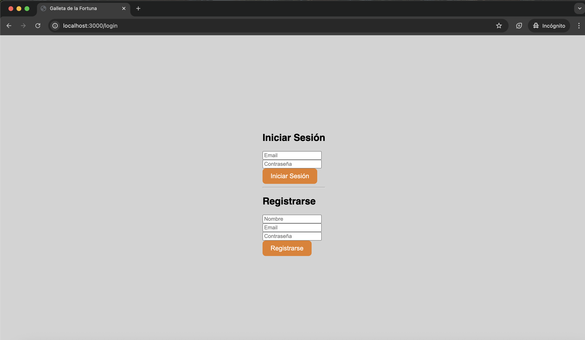
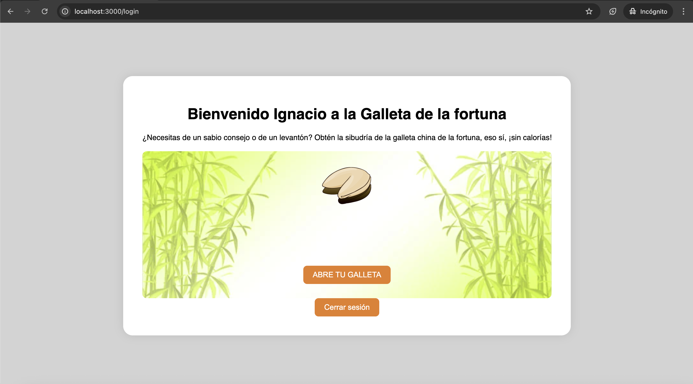
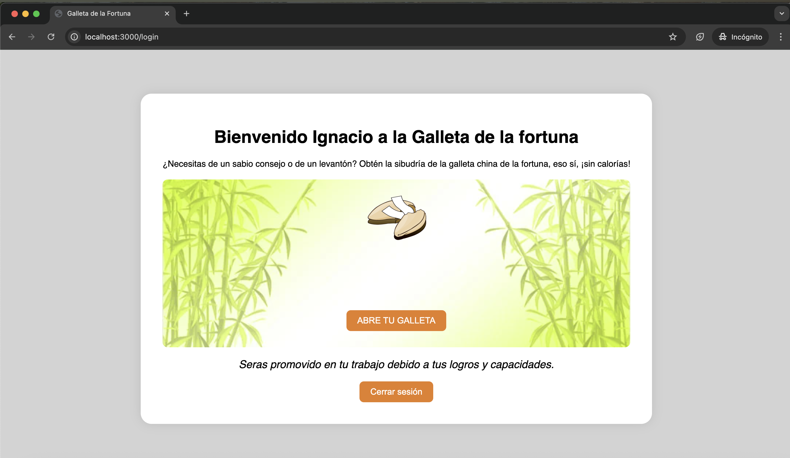

# Segundo Parcial Producción Web

## Profesor: Horacio Valenzuela
## Alumno: Ignacio Heim

### Funcionalidades
La funcionalidad de la aplicación consiste en un sistema para abrir de forma aleatoria una galleta de la fortuna.

El usuario deberá estar logueado para poder hacer click en el boton.

La url de la aplicacion es: **http://localhost:3000/login**

### Estrucutra del proyecto
    /cookie
        /angularjs-cookie   -> Frontend
        /cookie-aip         -> Backend

### Capturas de pantalla de la adopción

1. Login y registro

2. Ingreso a la plataforma

3. Frase aleatoria

